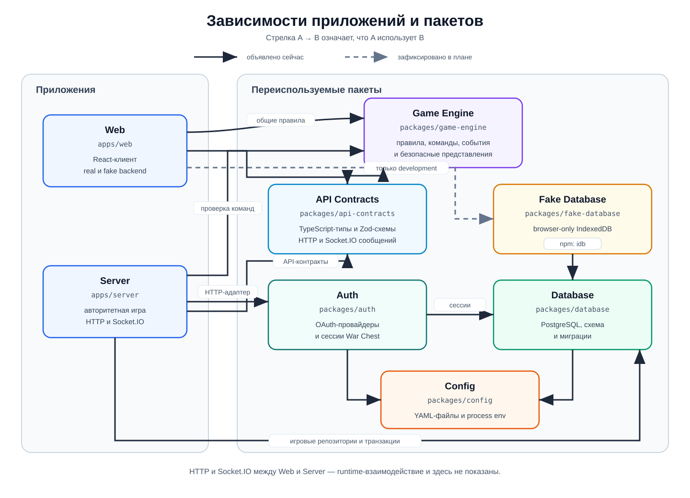

# Документация War Chest

Здесь собираем архитектурные решения, планы и описание механик проекта. Документация должна помогать понять не только то, как что-то устроено, но и зачем мы выбрали именно такой подход.

## Разделы

- [План разработки веб-игры](./development-plan/README.md) — путь от текущего каркаса монорепозитория до первого рабочего мультиплеерного сценария.
- [База данных](./database/README.md) — реализованная PostgreSQL-схема,
  конфигурация пакета, миграции и команды для локальной работы.
- [Авторизация](./auth/README.md) — фактическое поведение OAuth-провайдеров,
  сессий и обработки аватаров в `@war-chest/auth`.
- [Game engine](./game-engine/README.md) — реализованный технический игровой
  сценарий, события, восстановление состояния и безопасные представления.

## Зависимости приложений и пакетов

В монорепозитории два приложения и пять пакетов. Схема ниже разделяет уже
объявленные workspace-зависимости и связи, которые зафиксированы в плане
разработки, но пока не добавлены в `package.json`.

Стрелка читается как «узел слева использует узел справа». Сплошные стрелки —
текущие зависимости из `package.json`, пунктирные — целевые зависимости из
плана разработки.

Связь клиента с сервером через HTTP и Socket.IO на схеме не показана: это
runtime-взаимодействие, а не импорт workspace-пакета. `fake-database` также
отделён от production-контура — клиент должен загружать его только в
development-сборке после выбора fake backend.

Технический пакет `config` не владеет настройками конкретной части системы. Он
только одинаково читает `env.yaml`, необязательный `env.local.yaml` и известные
переменные процесса для `auth` и `database`; типизированные схемы остаются в
пакетах-потребителях.

## Как работать с документацией

План разработки — живой документ. По мере обсуждения мы будем уточнять решения, отмечать завершённые этапы и переносить устойчивые договорённости в отдельную архитектурную документацию.
