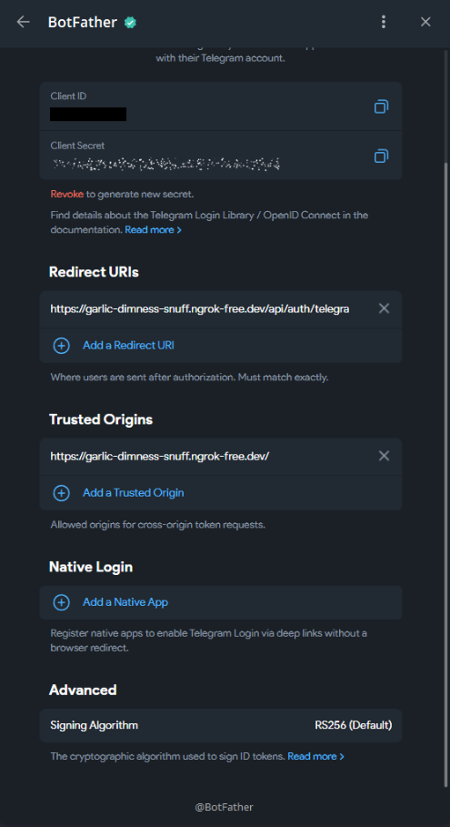

# Локальный вход через Telegram

Telegram OpenID Connect требует заранее зарегистрированный HTTPS callback.
Собственный домен для локальной разработки не нужен: публичный HTTPS-туннель
направляет запросы в Vite на `localhost:5173`, а Vite проксирует `/api` в
Fastify на `localhost:3000`.

В результате браузер проходит весь OAuth flow на одном публичном origin, а
client secret и обмен authorization code остаются на сервере.

## Настройка BotFather

Новый OpenID Connect настраивается в Mini App самого `@BotFather`, а не в
классическом чат-меню с кнопкой `Domain`:

1. Откройте Mini App BotFather через меню вложений в чате.
2. Выберите нужного бота в `My Bots`.
3. Откройте `Login Widget`.
4. Если бот использует legacy widget, выберите
   `Switch to OpenID Connect Login`.

Для публичного origin `https://<dev-domain>` заполните поля так:

| Раздел          | Значение                                                 |
| --------------- | -------------------------------------------------------- |
| Redirect URIs   | `https://<dev-domain>/api/auth/telegram/callback`         |
| Trusted Origins | `https://<dev-domain>`                                    |
| Native Login    | Не настраивается для браузерного War Chest                |



Redirect URI должен совпадать с конфигурацией War Chest по схеме, hostname и
пути. После сохранения повторно откройте настройки и убедитесь, что URI остался
в списке. Client ID и Client Secret копируйте из одной OIDC-конфигурации одного
бота. Client Secret и Bot API token — разные значения.

Актуальные требования и параметры flow описаны в
[Telegram Login](https://core.telegram.org/bots/telegram-login).

## HTTPS-туннель

Для постоянного development-домена удобно использовать корневой script:

```shell
yarn dev:ngrok
```

Он запускает `ngrok http 5173`. Команда требует установленный ngrok, доступный
в `PATH`.

После запуска ngrok выводит сопоставление публичного адреса с Vite:

```text
https://<dev-domain> -> http://localhost:5173
```

Бесплатный ngrok при первом открытии показывает предупреждение
`ERR_NGROK_6024`. Нажмите `Visit Site` до начала Telegram login. После этого
предупреждение не показывается повторно в том же профиле браузера. В другом
профиле или режиме инкогнито его нужно пройти заново.

Ограничения development-домена и предупреждающей страницы описаны в
[документации бесплатного тарифа ngrok](https://ngrok.com/docs/pricing-limits/free-plan-limits).

Публичный туннель открывает development-сервер из интернета. Запускайте его
только на время проверки и не передавайте адрес посторонним.

## Конфигурация Vite

В `apps/web/env.local.yaml` укажите только hostname туннеля, без схемы и пути:

```yaml
__VITE_ADDITIONAL_SERVER_ALLOWED_HOSTS: '<dev-domain>'
```

Vite добавляет значение в `server.allowedHosts`. Эта настройка не входит в
`__WEB_CONFIG__` и не передаётся коду приложения в браузере. После изменения
перезапустите `yarn dev:web`.

Не используйте `allowedHosts: true`: точный hostname сохраняет защиту Vite от
DNS rebinding.

## Конфигурация авторизации

В `packages/auth/env.local.yaml` укажите серверные credentials и публичные URL:

```yaml
TELEGRAM_CLIENT_ID: '<client-id-from-botfather>'
TELEGRAM_CLIENT_SECRET: '<client-secret-from-botfather>'
TELEGRAM_REDIRECT_URI: 'https://<dev-domain>/api/auth/telegram/callback'

AUTH_SUCCESS_REDIRECT_URL: 'https://<dev-domain>'
AUTH_COOKIE_SECURE: true
AUTH_COOKIE_SAME_SITE: 'lax'
```

Значения Client ID и Client Secret оставляйте строками. Secret нельзя помещать
в `apps/web/env.local.yaml`: клиентская конфигурация используется при сборке
браузерного приложения.

`TELEGRAM_REDIRECT_URI` и URI в BotFather должны совпадать буквально.
`AUTH_SUCCESS_REDIRECT_URL` использует тот же публичный origin, чтобы session
cookie, установленная на callback, осталась доступна приложению после входа.

Auth-конфигурация читается при запуске Fastify. После её изменения полностью
перезапустите `yarn dev:server`.

## Запуск и проверка

Подготовьте PostgreSQL, затем запустите server, web и туннель в отдельных
терминалах:

```shell
yarn db:up
yarn db:migrate
```

```shell
yarn dev:server
```

```shell
yarn dev:web
```

```shell
yarn dev:ngrok
```

Откройте `https://<dev-domain>`, пройдите предупреждение ngrok, выберите real
backend в development-панели и нажмите «Продолжить с Telegram».

Успешный flow проходит по следующим адресам:

```text
GET /api/auth/telegram/start
  -> https://oauth.telegram.org/auth
  -> GET /api/auth/telegram/callback
  -> https://<dev-domain>
```

После callback Fastify устанавливает `Secure`, `HttpOnly` session cookie, а
клиент восстанавливает сессию через `GET /api/auth/session`.

## Диагностика

| Симптом                       | Что проверить                                                             |
| ----------------------------- | ------------------------------------------------------------------------- |
| Страница `ERR_NGROK_6024`     | Нажать `Visit Site` до начала OAuth flow                                  |
| Vite отклоняет hostname       | Значение без `https://` в web-конфигурации и перезапуск `yarn dev:web`    |
| `provider_disabled`           | Непустые Client ID и Client Secret в auth-конфигурации, перезапуск server |
| `redirect_uri required`       | Callback в Redirect URIs, точное совпадение URI и Client ID того же бота  |
| `invalid_oauth_state`         | Server не перезапускался во время flow, callback получил state cookie     |
| После входа снова виден login | Callback и success redirect используют один публичный origin              |

OAuth state хранится в памяти процесса. Если Fastify был перезапущен между
`/start` и callback, начните вход заново.
