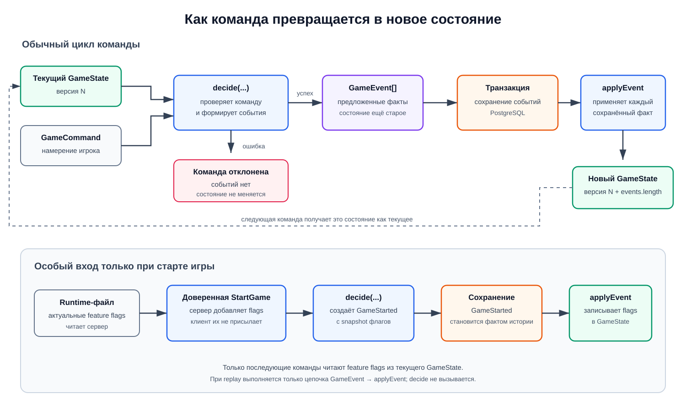

# Модель игры и общий движок

> Статус: технический сценарий до реализации правил готов. Фактическое
> поведение пакета описано в разделе [Game engine](../game-engine/README.md).
> Полные правила War Chest остаются будущим этапом.

`packages/game-engine` должен стать единственным местом, где описаны правила игры. Это позволит серверу проверять ходы, а клиенту — подсвечивать доступные действия и воспроизводить историю без двух разных реализаций правил.

Движок не должен зависеть от React, Socket.IO, Fastify или базы данных.

Полные правила реализуем после инфраструктуры, авторизации, синхронизации и технического сквозного сценария. Раньше создаём только типы-контракты и минимальную тестовую команду, необходимую для проверки остальных слоёв.

## Что нужно определить

- состояния игры: ожидание, активная партия, завершение;
- роли участника: игрок и зритель;
- порядок хода;
- команды, которые может отправить игрок;
- события, которые появляются после принятой команды;
- публичные и скрытые части состояния;
- условия завершения партии и определения результата;
- версию формата событий.

## Предлагаемая структура

```text
packages/game-engine/src/
  state.ts
  command-data/
    lifecycle-command-data.ts
    test-scenario-command-data.ts
  commands.ts
  events.ts
  view-events.ts
  errors/
    nullable-game-state-error.ts
    nullable-game-view-error.ts
  create-game.ts
  decide.ts
  apply-event.ts
  apply-view-event.ts
  restore-game.ts
  restore-view.ts
  create-view.ts
  create-view-event.ts
  commands/
    decidable-command.ts
    hydrate-command.ts
    lifecycle/
      hydrate-lifecycle-command.ts
      lifecycle-rules.ts
      join-game-command.ts
      start-game-command.ts
      finish-game-command.ts
    test-scenario/
      hydrate-test-scenario-command.ts
      test-move-command.ts
  events/
    applicable-event.ts
    hydrate-event.ts
    lifecycle/
      hydrate-lifecycle-event.ts
      game-created-event.ts
      player-joined-event.ts
      game-started-event.ts
      game-finished-event.ts
    test-scenario/
      hydrate-test-scenario-event.ts
      test-move-performed-event.ts
  view-events/
    applicable-view-event.ts
    hydrate-view-event.ts
    lifecycle/
      hydrate-lifecycle-view-event.ts
      game-created-view-event.ts
      player-joined-view-event.ts
      game-started-view-event.ts
      game-finished-view-event.ts
    test-scenario/
      hydrate-test-scenario-view-event.ts
      test-move-performed-view-event.ts
    synchronization/
      hydrate-synchronization-view-event.ts
      view-sequence-advanced-event.ts
  index.ts
```

Основные операции:

```ts
function createGame(command: CreateGameCommandData): GameCreatedEventData;

function decide(
  state: GameState,
  playerId: string,
  command: GameCommandData,
): GameEventData[];

function hydrateCommand(command: GameCommandData): DecidableCommand;

function applyEvent(
  state: GameState | null,
  event: GameEventData,
): GameState;

function hydrateEvent(event: GameEventData): ApplicableEvent;

function parseGameEventData(value: unknown): GameEventData;

function restoreGame(events: GameEventData[]): GameState | null;

function createViewFor(
  state: GameState,
  viewer: Viewer,
): GameView;

function createViewEventFor(
  event: GameEventData,
  viewer: Viewer,
): GameViewEventData;

function applyViewEvent(
  view: GameView | null,
  event: GameViewEventData,
): GameView;

function hydrateViewEvent(
  event: GameViewEventData,
): ApplicableViewEvent;

function restoreView(events: GameViewEventData[]): GameView | null;
```

`createGame` создаёт первый `GameCreated` без искусственного состояния ещё не
существующей игры. После его применения появляется `GameState` со статусом
`waiting`. Для всех последующих команд вызывается `decide`: он не изменяет
переданный `GameState`, а проверяет, допустима ли команда, и возвращает события,
которые описывают её результат. При отказе событий нет и состояние остаётся
прежним. Server преобразует пустой массив в `commandRejected`, не сохраняет
`processed_commands` и не вызывает repository mutation.

`decide` гидратирует `GameCommandData` во временный `DecidableCommand` и
вызывает его метод `decide(state, playerId)`. Lifecycle-команды и команды
технического сценария используют отдельные групповые `switch`-гидраторы, поэтому
добавление команды меняет только файлы своей механики.

`parseGameEventData` — единственная runtime-граница для внутренних событий. Она
проверяет unknown-значение целиком: metadata, известные type/version, payload,
boolean feature flags и рекурсивные JSON-данные. `hydrateEvent` не повторяет эту
проверку и принимает уже валидный `GameEventData`. Server repository вызывает
parser сразу после чтения каждой строки PostgreSQL; transport-схемы
`api-contracts` внутренними событиями не владеют.

Parser проверяет отдельное событие, но не порядок цепочки. Непрерывность
sequence, первый `GameCreated` и совпадение последнего sequence с сохранённой
версией игры остаются проверками server application-слоя перед replay.

Сервер сохраняет полученные события в PostgreSQL. Только после успешной
транзакции он последовательно передаёт каждое событие в `applyEvent` и получает
новый `GameState`. `applyEvent` не проверяет игровые правила: это
детерминированная функция применения уже произошедшего факта. Она проверяет
только структуру истории — первый `GameCreated` применяется к `null` и не может
встретиться повторно.



При создании игры есть один дополнительный доверенный вход. Сервер читает
актуальный runtime-файл и сам добавляет feature flags в команду `CreateGame`.
Клиент эти значения не присылает. `createGame` создаёт событие `GameCreated` с
полным snapshot флагов.

После сохранения `GameCreated` функция `applyEvent(null, event)` создаёт
`GameState` и переносит в него snapshot. Все последующие вызовы `decide`,
включая `StartGame`, читают зафиксированные значения из состояния этой игры.
Текущий runtime-файл больше не участвует в её поведении, а `GameStarted` не
дублирует feature flags.

При восстановлении или replay команды уже не проверяются повторно: server
валидирует сохранённые события через `parseGameEventData`, а затем вызывает
`applyEvent`. Функция гидратирует проверенные данные в runtime-объект
`ApplicableEvent` и вызывает его метод `apply`. Благодаря этому прошлый
результат не зависит от текущих правил, feature flags или внешней конфигурации.

`PlayerDefeated` с причиной `disconnectTimeout` удаляет игрока из очереди ходов и фиксирует поражение. Если после этого выполнено условие завершения партии, движок создаёт `GameFinished`.

`GameCreated` создаёт пустые массивы команд `white` и `black`. После него и до
`GameStarted` игрок явно выбирает в UI свободную позицию и передаёт в `JoinGame`
связанные поля `team` и `seat`. Событие `PlayerJoined` сразу добавляет игрока в
выбранную команду, поэтому состав доступен уже в состоянии `waiting` и
детерминированно восстанавливается без отдельного snapshot в `GameStarted`.
Текущий сценарий предоставляет позиции `white/1` и `black/1`; порядок
присоединения на команду и право первого хода не влияет. `GameFinished` хранит
`winnerTeam`, поэтому при переходе к формату два на два контракт завершения
партии и история профиля не зависят от числа игроков в команде.

Для replay `applyEvent` должен быть детерминированным: случайность вычисляется до создания события, а в событии сохраняется уже получившийся результат.

Клиент не получает полный `GameState` и внутренние `GameEventData` со скрытыми
данными. Сервер преобразует события в безопасные для конкретного получателя
`GameViewEventData`. Функции `applyViewEvent` и `restoreView` позволяют клиенту
последовательно обновлять live-представление и локально восстанавливать любую
точку истории из той же безопасной цепочки.

Runtime-класс внутреннего события создаёт безопасный контракт через
`toViewData(viewer)`. На стороне получателя `hydrateViewEvent` превращает этот
JSON в отдельный `ApplicableViewEvent`, который применяет только разрешённые
данные к `GameView`. Внутренний runtime-объект с полным payload клиенту не
передаётся.

Каждому внутреннему событию соответствует событие представления с тем же
sequence number. Если изменение полностью скрыто от получателя, используется
нейтральное `ViewSequenceAdvanced`: оно обновляет `lastEventSequence`, но не
меняет остальные данные `GameView`. Благодаря этому клиент видит непрерывную
последовательность и не принимает скрытое событие за потерю данных.

`applyViewEvent` также детерминирована и не проверяет допустимость команд.
Просмотр истории никогда не вызывает `decide`: доступные действия вычисляются
отдельно из последнего live-представления.

Движок не управляет анимациями. Он синхронно вычисляет состояние до и после
события, а клиентский UI решает, нужен ли между ними визуальный переход. Поэтому
одно и то же событие можно применить мгновенно при восстановлении состояния или
проиграть с анимацией при просмотре поля, не меняя игровую логику.

## Технический сценарий до реализации правил

**Статус: ✅ реализовано.**

До реализации правил используем небольшой сценарий, который проверит архитектуру:

1. Создать игру.
2. Присоединить двух игроков.
3. Начать партию.
4. По очереди выполнить несколько тестовых ходов.
5. Завершить партию.
6. Восстановить итоговое состояние только из событий.

Тестовый ход заменяем настоящей механикой в последнем этапе, не меняя транспорт, авторизацию и хранение.

Реализация также проверяет безопасную доставку приватной части тестового хода:
её получает только сделавший ход игрок, а второй игрок и зритель видят только
публичную часть события.

## Когда начинаем полную реализацию

К правилам переходим после того, как:

- оба приложения читают конфигурацию;
- база и миграции запускаются одной командой;
- Google, Telegram и Yandex ID создают сессию War Chest;
- два клиента и зритель подключаются к одной игре;
- события сохраняются и восстанавливаются;
- reconnect и feature flags проверены сквозными тестами.

## Критерии готовности

Игровые критерии технического сценария выполнены и проверены модульными
тестами. Runtime-parser сохранённых событий реализован и проверен на каждом
поддерживаемом событии. После замены `TestMove` на настоящие правила весь набор
нужно будет проверить повторно.

- правила работают без запущенного сервера и браузера;
- одинаковая последовательность событий всегда создаёт одинаковое состояние;
- недопустимая команда не создаёт событий;
- runtime-parser принимает каждый поддерживаемый event и отклоняет неизвестный
  type/version или некорректный payload;
- представление зрителя не содержит скрытых данных;
- ключевые правила покрыты модульными тестами.
