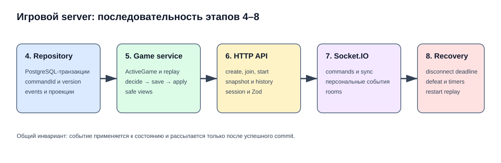

# Реализация игрового server: этапы 4–8

Этот раздел — автономная постановка задачи для продолжения server-разработки.
Его можно передать агенту, который не видел обсуждение: здесь зафиксированы
текущая граница, принятые решения, порядок работ и ссылки на фактический код.

До начала любого этапа нужно прочитать корневой `AGENTS.md`, актуальную
[документацию server](../../server/README.md),
[схему базы](../../database/schema.md) и
[контракт game engine](../../game-engine/README.md). Development plan описывает
целевое поведение; фактические документы — уже доступное поведение.

## Текущая граница

Перед этапом 4 уже готовы:

- PostgreSQL-схема `games`, `game_participants`, `processed_commands` и
  `game_events` в `@war-chest/database`;
- `FeatureFlags = Readonly<Record<string, boolean>>` во всех контурах;
- runtime-reader и `GET /api/config/feature-flags.json`;
- OAuth, session adapter и `requireAuthSession`;
- user repository и профильные HTTP endpoints;
- команды, события, replay и безопасные views в `@war-chest/game-engine`;
- общие transport-типы, Zod-схемы и UUID-валидация `gameId`/`commandId`;
- Socket.IO authentication, runtime-валидация и комнаты без игровой обработки.

## Зафиксированные решения

Эти решения не нужно повторно согласовывать:

1. `commandId` создаёт клиент; это UUID и idempotency key команды.
2. Создание строки игры, `processed_commands` и события `GameCreated` выполняется
   одной PostgreSQL-транзакцией.
3. `games.currentVersion` всегда равен `sequence` последнего сохранённого
   события игры.
4. Повторный `commandId` определяется до проверки `expectedVersion`. Команда не
   выполняется второй раз; service возвращает клиенту актуальный snapshot или
   недостающие события.
5. События применяются к `ActiveGame.state` только после успешного commit.
6. Полная цепочка `game_events` — источник истины; постоянные snapshots
   `GameState` не добавляются.
7. Для игровых правил feature flags читаются из runtime-файла только при
   создании игры, после чего восстанавливаются из `GameCreated`. Application
   endpoint перечитывает тот же файл независимо.
8. Зрители не сохраняются в `game_participants`.

## Порядок этапов

| Этап                                                      | Главный результат                               | Зависит от |
| --------------------------------------------------------- | ----------------------------------------------- | ---------- |
| [4. Игровой репозиторий](./04-game-repository.md)         | Атомарное хранение команд, событий и проекций   | готово     |
| [5. Game service](./05-game-service.md)                   | Последовательная обработка и `ActiveGame`       | этап 4     |
| [6. Игровой HTTP API](./06-game-http-api.md)              | Создание, join, start, snapshot и history       | этап 5     |
| [7. Игровой Socket.IO](./07-game-socket-io.md)            | Команды и персонализированная рассылка          | этап 5–6   |
| [8. Reconnect и recovery](./08-reconnect-and-recovery.md) | Deadline, defeat и восстановление после restart | этап 7     |

Каждый этап должен завершаться обновлением фактической документации в
`docs/server`, запуском ESLint с исправлениями, typecheck и затронутых тестов.
Не следует начинать следующий этап, пока результат текущего не проверен.
