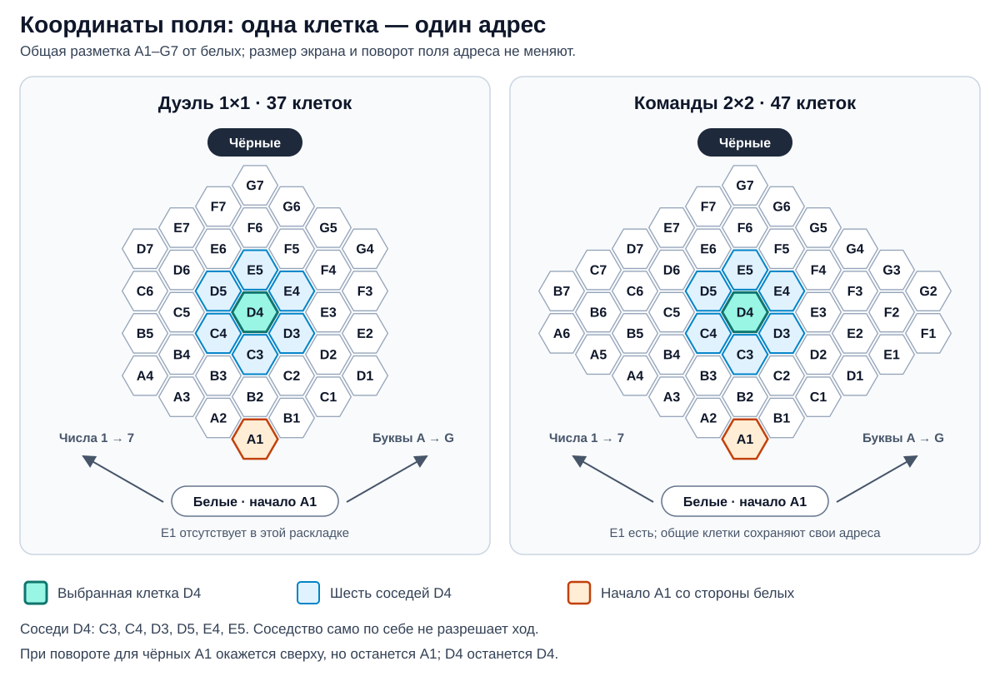

# Координаты клеток от команды белых

Статус: система `A1–G7`, постоянная ориентация от белых и использование
`cellId` в событиях согласованы 13 сентября 2026 года. Детали реализации ниже
предложены для переноса в движок; имена и формы новых типов/событий ещё не
являются production API.

## Что видит игрок

Адрес состоит из латинской заглавной буквы и числа: `A1`, `D4`, `G7`.
В каноническом виде белые внизу. `A1` — нижняя вершина ромба со стороны белых,
`G7` — верхняя. Из `A1` буквы идут вверх-вправо, числа — вверх-влево.
Это две наклонные оси шестиугольного поля.

Координаты одинаковы у белых, чёрных, союзников и зрителя. Поворот, масштаб,
desktop/mobile и переключение карточек игроков меняют только представление.
`D4` никогда не переименовывается. Надписи на повернутом поле остаются читаемыми.

По текущим мастер-компонентам
[1×1](https://www.figma.com/design/3dryG8iK34xmpJF7HLYeau/War-Chest?node-id=238-4)
и [2×2](https://www.figma.com/design/3dryG8iK34xmpJF7HLYeau/War-Chest?node-id=238-3817)
проверены 37 и 47 отдельных позиций соответственно, включая руду.
Оба поля используют одну сетку `A1–G7`. Пропущенные клетки не перенумеровываются;
например, `E1` существует в командном поле, но отсутствует в дуэльном.



Схема показывает оба поля в одном масштабе. Стрелки задают направление роста
букв и чисел от стороны белых; выделены `D4` и её непосредственные соседи.
При повороте поля поворачивается раскладка, а адрес каждой клетки сохраняется.

Подписи можно показывать переключателем или для выбранной клетки и её целей.
В журнале и доступном имени клетки адрес присутствует всегда.

## Как это хранится и проверяется

В состоянии и событиях использовать одну каноническую строку `cellId`.
Числовые индексы для расчётов получать из неё: `A1 → (0, 0)`, `D4 → (3, 3)`.
Не хранить одновременно независимые строковый и числовой адреса.

В текущей геометрии непосредственные соседи изменяют индексы на
`(+1, 0)`, `(-1, 0)`, `(0, +1)`, `(0, -1)`, `(+1, +1)`, `(-1, -1)`.
Поэтому соседи `D4`: `C3`, `C4`, `D3`, `D5`, `E4`, `E5`.
После расчёта обязательно отфильтровать клетки, отсутствующие в раскладке.
Соседство ещё не означает допустимость хода: занятость и правила юнита
проверяются отдельно.

Проверенная форма мастер-полей укладывается в правило для индексов 0–6:
`abs(column - row) <= 3` для дуэли, `<= 5` для команд.
В движке предлагается явное версионируемое описание раскладки с набором
клеток и точками руды. Формула полезна для проверки текущего набора, но не
должна мешать будущим раскладкам.

Формат `A1–G7` проверяется синтаксически, принадлежность клетки — по раскладке
текущей игры. Тип TypeScript сам по себе не защищает входящие JSON-команды.
Версия/идентификатор раскладки фиксируются при создании либо инициализации
поля и восстанавливаются из событий. Старая партия использует свою раскладку.
Полный контекст адреса — партия, её версия раскладки и `cellId`.

Проекция в экранные `x/y`, поворот и размеры не входят в игровые события.
В вычислительном коде можно использовать числовые координаты, но отдельная
вторая система именования клеток для API не нужна.

## Примеры фактов и приёмка

Сокращённые примеры новых событий, без существующего общего envelope:

```json
{
  "type": "UnitMoved",
  "payload": {
    "unitId": "unit-17",
    "fromCellId": "D4",
    "toCellId": "E4"
  }
}
```

```json
{
  "type": "ControlPointCaptured",
  "payload": {
    "unitId": "unit-17",
    "cellId": "E4",
    "previousOwnerTeam": null,
    "ownerTeam": "white"
  }
}
```

Во втором примере `E4` — точка руды текущего дуэльного макета в согласованной
разметке от белых. Сервер проверяет наличие точки в описании раскладки.

`unitId` обозначает конкретный отряд на поле, а не тип карты. Если точка
неподвижна и в клетке не бывает двух разных точек, её достаточно определить
через `cellId`; отдельный `controlPointId` пока не нужен. Состояния владения
хранят `white/black`, а визуальные ally/enemy вычисляются для получателя.

При реализации проверить: уникальность всех 37/47 адресов, сохранение адресов
общих клеток, шесть соседей центра, края и вырезы, отказ для отсутствующего
`E1` в дуэли, одинаковый адрес цели после поворота, совпадение snapshot и replay
после движения и захвата. Это отдельные контракты для отдельных тестов.
