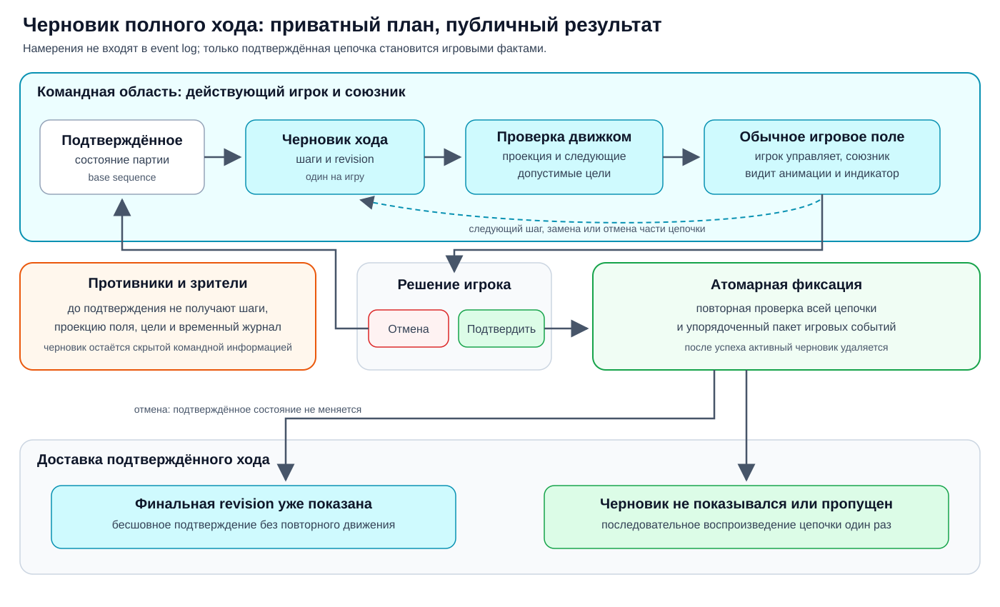

# Черновик полного хода

Статус: поведение согласовано 16 сентября 2026 года. Реализация относится к
этапу 6; этап 5 только готовит совместимый renderer игрового поля.

Черновик позволяет игроку собрать весь ход, проверить его результат, обсудить
план с союзником и только затем открыть действия противникам. Отмена и замена
шагов не изменяют подтверждённое состояние партии и не загрязняют replay.

## Черновик и игровые факты

Намерения игрока не записываются в основной поток игровых событий. Событие
описывает уже свершившийся факт, а отменённые варианты не должны попадать в
историю партии.

Сервер хранит не больше одного активного черновика на игру. Черновик относится
ко всему текущему ходу, а не к одному отдельному действию. В нём нужны:

- идентификатор черновика;
- версия подтверждённой партии, от которой он начат;
- монотонная ревизия изменений;
- упорядоченные типизированные шаги;
- спроецированное состояние после этих шагов;
- допустимые цели следующего этапа.

Это описание задаёт смысл данных, но не закрепляет имена будущих TypeScript
типов и команд.

## Создание и изменение

Первое действие текущего игрока создаёт черновик. Каждый следующий клик или
desktop drop добавляет шаг. Движок проверяет шаг относительно проекции после
предыдущих шагов и возвращает новую ревизию, состояние поля и допустимые цели.

Игрок может:

- отменить весь черновик;
- удалить последний шаг;
- удалить более ранний шаг;
- заменить оставшуюся часть цепочки;
- подтвердить весь ход.

При удалении промежуточного шага удаляются и все последующие шаги: они были
проверены относительно уже недействительного состояния. Предыдущая корректная
часть черновика сохраняется.

Клик и drag and drop различаются только способом ввода. Оба создают одинаковый
игровой шаг с `unitId` и целью. На mobile достаточно последовательных нажатий;
drag and drop на touch-устройствах не требуется.

## Последовательные способности

Способности с несколькими решениями оформляются как последовательность шагов,
а не как одновременный выбор нескольких целей. Для Bannerman согласованы три
равнозначных способа ввода:

1. выбрать Bannerman, выбрать соседнюю клетку, выбрать соседний с новой
   позицией юнит и выбрать клетку для его перемещения;
2. перенести Bannerman на соседнюю клетку, затем выбрать второй юнит и его
   клетку назначения;
3. перенести Bannerman, затем перенести второй юнит.

Во всех вариантах движок получает одну и ту же последовательность шагов.
Конкретные правила Bannerman, стоимость и допустимые цели согласуются отдельно
перед реализацией способности.

Для дистанционной тактики вроде действия лучника renderer получает допустимые
`unitId` целей. При выборе цели неинтерактивный SVG-слой может показать стрелку
от атакующего к вражескому юниту. Её окончательная форма и состояния будут
отдельно определены в Figma.

## Видимость и управление

Действующий игрок и его союзник видят каждую принятую ревизию на обычном
игровом поле с теми же перемещениями и анимациями, которые использует поле.
Союзнику дополнительно нужен явный индикатор, что сейчас показан ещё не
подтверждённый план.

Только действующий игрок может менять, отменять и подтверждать черновик.
Для него в журнале появляется временный элемент с шагами, удалением шагов,
отменой всего хода и подтверждением. Отмена и подтверждение также доступны на
поле. Композиция, подписи и визуальные состояния этих контролов должны быть
сначала согласованы в Figma.

Противники и зрители до подтверждения не получают:

- шаги черновика;
- его спроецированное поле;
- допустимые цели;
- временные строки журнала.

Командная доставка — это область видимости данных, а не отдельный экран.
Союзник наблюдает черновик в том же renderer игрового поля.

## Подтверждение и воспроизведение

При подтверждении сервер повторно проверяет всю цепочку относительно актуальной
версии партии. Если она допустима, весь ход фиксируется одной транзакцией как
упорядоченный пакет фактических событий. Частично подтверждённого хода быть не
может.

После успешной транзакции активный черновик удаляется, а пакет получают все
участники. Автоматическое воспроизведение определяется не длиной цепочки, а
тем, видел ли конкретный клиент её финальную ревизию:

- игрок и союзник уже показали ту же финальную ревизию — черновик бесшовно
  становится подтверждённым без повторного движения юнитов;
- противник или зритель черновик не видел — цепочка проигрывается один раз;
- игрок или союзник пропустил финальную ревизию — подтверждённая цепочка
  проигрывается как новая;
- snapshot после загрузки сразу показывает актуальное состояние и не запускает
  старые анимации.

Во время автоматического воспроизведения можно пропустить или ускорить
цепочку. В журнале подтверждённого хода предусматривается ручной повтор. При
`prefers-reduced-motion: reduce` события применяются в том же порядке без
пространственных переходов.

Порог по числу действий не используется: одно действие может быть длиннее
нескольких коротких, а повтор уже просмотренного черновика выглядит как ошибка.

## Жизненный цикл и восстановление

Черновик переживает обновление страницы и переподключение игрока или союзника.
Подключившийся клиент получает текущую ревизию и её спроецированное состояние.
Хранение заменяет один активный черновик по игре, а не создаёт архив версий.

Черновик удаляется после:

- успешного подтверждения;
- явной отмены;
- завершения или смены текущего хода другим допустимым способом;
- обнаружения, что базовая версия партии больше не позволяет продолжить план;
- завершения партии.

Каждое обновление содержит идентификатор и ревизию. Клиент не применяет
запоздавшее обновление поверх более новой версии. Подтверждённый пакет связывается
с финальной ревизией черновика, чтобы клиент мог выбрать бесшовное подтверждение
или последовательное воспроизведение.

Приватность отдельно проверяется для действующего игрока, союзника, противника
и зрителя в real и fake backend. Черновик не попадает в публичный `GameView`,
общий query cache, event log или API истории.
