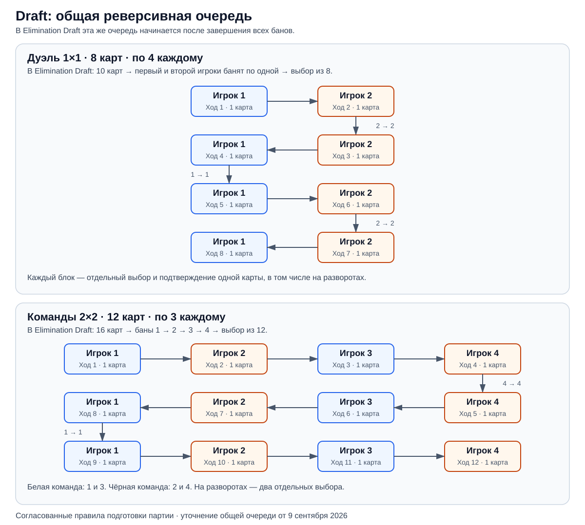

# Выбор карт: Random, Draft и Elimination Draft

Выбор карт формирует набор юнитов каждого игрока перед игрой на поле. Random
распределяет карты случайно, Draft даёт игрокам выбрать их самим, а
Elimination Draft добавляет предварительное исключение карт из выбора.

> Статус: согласованные правила по обсуждениям и макетам Figma 7–8 сентября
> 2026 года с уточнением общей очереди выбора от 9 сентября. Это требования
> к игровому движку; в текущем техническом сценарии выбора карт ещё нет.

Источник карт определяется [составом игры](./gameModes.md): базовая игра и
включённые дополнения. После завершения выбора у каждого участника дуэли
четыре уникальные карты, у каждого участника командной партии — три.
Уникальность общая для всех игроков.

| Способ выбора     | Дуэль 1×1                              | Команды 2×2                             |
| ----------------- | -------------------------------------- | --------------------------------------- |
| Random            | Случайно по 4 карты каждому            | Случайно по 3 карты каждому             |
| Draft             | 8 случайных карт, выбор до 4 у каждого | 12 случайных карт, выбор до 3 у каждого |
| Elimination Draft | 10 случайных карт, 2 бана, выбор из 8  | 16 случайных карт, 4 бана, выбор из 12  |

## Random

Каждый игрок случайно получает свой набор из общего пула: четыре карты в
дуэли или три в командной партии. Карты распределяются без повторений во
всей партии. Всего раздаётся восемь карт для 1×1 или двенадцать для 2×2.

Ручных выборов и банов в этом режиме нет.

## Draft

После подготовки партии игроки переходят к отдельному этапу выбора карт.
Из общего пула случайно формируется пул выбора без повторений: восемь карт
для дуэли или двенадцать для командной партии. Все карты этого пула будут
распределены между игроками.

### Общая очередь выбора

Дуэль и командная партия используют один алгоритм. Для него нужны
упорядоченный список игроков и количество карт, которое должен получить
каждый. Число игроков определяется длиной списка.

1. Выбор начинается с первого игрока и идёт по списку вперёд.
2. Каждый ход — выбор и подтверждение ровно одной доступной карты.
3. После прохода всего списка направление меняется. Следующий проход
   начинается с того же крайнего игрока, который завершил предыдущий.
4. Проходы вперёд и назад повторяются, пока каждый не получит нужное
   количество карт. После достижения этого количества выбор завершается.

На развороте один игрок делает два последовательных хода по одной карте.
Каждое подтверждение завершает отдельный ход выбора; следующим действующим
игроком при этом может остаться тот же участник.

За один полный проход каждый получает одну карту. Поэтому для дуэли нужны
четыре прохода списка из двух игроков, а для командной партии — три прохода
списка из четырёх. Модель передачи хода общая; различаются только число
игроков и итоговое количество карт у каждого.

### Очереди для двух форматов

| Формат        | Игроков | Карт у каждого | Проходов | Ходов выбора |
| ------------- | ------- | -------------- | -------- | ------------ |
| Дуэльный 1×1  | 2       | 4              | 4        | 8            |
| Командный 2×2 | 4       | 3              | 3        | 12           |

В дуэли полная очередь: **1 → 2 → 2 → 1 → 1 → 2 → 2 → 1**.
После восьми отдельных выборов у обоих игроков по четыре карты.

В командной партии полная очередь:
**1 → 2 → 3 → 4 → 4 → 3 → 2 → 1 → 1 → 2 → 3 → 4**.
Игроки 1 и 3 входят в белую команду, игроки 2 и 4 — в чёрную.
После двенадцати отдельных выборов у каждого игрока по три карты,
у каждой команды — по шесть.

Нумерация описывает очередь выбора карт. Способ назначения первого игрока
и связь этой очереди с первым ходом на игровом поле отдельно не согласованы.

## Elimination Draft

Здесь перед выбором каждый игрок запрещает одну карту для всех участников.
Для дуэли случайно формируется пул из десяти разных карт, для командной
партии — из шестнадцати.

В дуэли сначала первый игрок банит одну карту, затем второй банит другую.
Остаётся восемь доступных карт. Первый игрок начинает выбор по общей
реверсивной очереди: **1 → 2 → 2 → 1 → 1 → 2 → 2 → 1**, по одной карте
за ход. В итоге две карты забанены, у каждого игрока по четыре выбранные карты.

В командной партии баны идут в порядке **1 → 2 → 3 → 4**, по одной карте
от каждого игрока. После четырёх банов остаётся двенадцать доступных карт.
Игрок 1 начинает выбор, далее используется та же реверсивная очередь, что
и в командном Draft. В итоге четыре карты забанены, у каждого игрока по три
выбранные карты.

Баны завершаются до начала выбора. Забаненная карта остаётся видимой с
указанием автора бана, но выбрать или повторно забанить её уже нельзя.

## Доступность действий и результат

Движок проверяет текущую очередь, стадию бана или выбора и доступность карт.
Уже выбранная карта закрепляется за игроком и становится недоступной для
последующих выборов. Для каждой выбранной или забаненной карты известно,
какой игрок совершил действие; эти сведения видны участникам.

В макетах выбор подтверждается отдельным действием: до подтверждения его
можно изменить. Подсветка ещё не подтверждённых карт — состояние интерфейса;
подтверждённый результат должен проходить через игровую команду. При ожидании
чужого хода собственный выбор недоступен.

В командном макете потери соединения уже выбранные карты сохраняются, новые
действия недоступны, а после восстановления связи обновляется текущий ход.
Сохранённые результаты выбора восстанавливаются из истории по общим правилам
движка.

Выбор завершается после распределения нужного количества карт каждому
игроку. После этого участники переходят к игровому столу.

Макеты экранов:

- [Дуэль: Draft](https://www.figma.com/design/3dryG8iK34xmpJF7HLYeau/War-Chest?node-id=477-5158).
- [Дуэль: Elimination Draft](https://www.figma.com/design/3dryG8iK34xmpJF7HLYeau/War-Chest?node-id=477-5159).
- [Команды: Draft](https://www.figma.com/design/3dryG8iK34xmpJF7HLYeau/War-Chest?node-id=509-10686).
- [Команды: Elimination Draft](https://www.figma.com/design/3dryG8iK34xmpJF7HLYeau/War-Chest?node-id=509-10687).

13 сентября дуэльные макеты приведены к согласованному правилу: каждый выбор
одной карты подтверждается отдельно. При двух последовательных ходах того же
игрока первая карта уже находится в выбранных, а следующая подтверждается
отдельным действием; порядок получения карт сохраняется.
