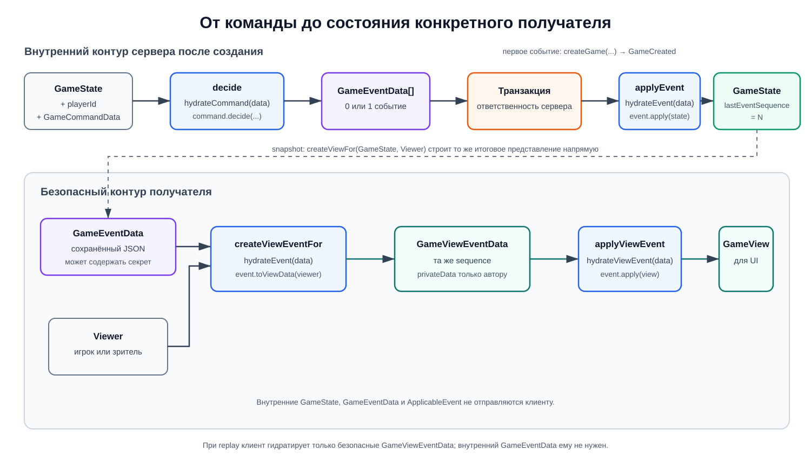

# События и восстановление состояния

История событий — единственный вход для восстановления игры. В PostgreSQL
хранятся обычные JSON-объекты `GameEventData`. При применении движок временно
гидратирует их в классы с поведением; экземпляры классов в базу не попадают.
Команды нужны только в live-сценарии: replay не запускает проверки заново и
потому не зависит от будущих изменений в `decide`.



## Цикл принятой команды

Создание стоит отдельно от обычного цикла: сервер вызывает `createGame`,
сохраняет `GameCreated`, а затем получает первое состояние через
`applyEvent(null, event)`.

Для последующих команд:

1. Сервер передаёт текущее состояние, идентификатор игрока и команду в
   `decide`.
2. Движок возвращает `GameEventData[]`. Обычная команда создаёт ноль или одно
   событие, а defeat по reconnect timeout — `PlayerDefeated` и следующий
   `GameFinished`.
3. Сервер сохраняет принятые события и метаданные команды в транзакции.
4. Только после успешного сохранения сервер вызывает `applyEvent` для каждого
   события.
5. Полученное состояние становится актуальным состоянием активной игры.

Шаг с транзакцией находится за границей пакета. Сам game engine не знает о
PostgreSQL и не гарантирует сохранение события.

## Команды, события и runtime-объекты

`GameCommandData` — discriminated union входных JSON-контрактов. Он объединяет
групповые union-типы `LifecycleCommandData` и `TestScenarioCommandData`, поэтому
новая команда внутри существующей механики не меняет центральный union.

`DecidableCommand` — временный runtime-объект команды:

```ts
interface DecidableCommand<Data extends GameCommandData> {
  readonly data: Data;

  decide(state: GameState, playerId: string): GameEventData[];
  toData(): Data;
}
```

Публичный `decide` сохраняет функциональный API, но делегирует решение классу:

```ts
return hydrateCommand(data).decide(state, playerId);
```

`GameEventData` — discriminated union сериализуемых контрактов. Эти объекты
создаёт `decide`, сохраняет сервер и получает обратно при replay.

Значение, прочитанное из PostgreSQL, сначала проходит через
`parseGameEventData(value: unknown)`. Parser строго проверяет metadata,
поддерживаемый type/version и полный payload каждого события. В частности, он
не принимает неизвестные поля, non-boolean feature flags или значения вне
рекурсивного JSON-контракта.

Значения `FeatureFlags` всегда имеют тип `boolean`. Поэтому при переносе
snapshot достаточно поверхностной копии объекта; рекурсивное клонирование для
feature flags не выполняется. Числа, строки и `null` остаются допустимы только
внутри общего `JsonValue`, например в приватных данных тестового хода.

`ApplicableEvent` — временный runtime-объект со следующими операциями:

```ts
interface ApplicableEvent<Data extends GameEventData> {
  readonly data: Data;

  apply(state: GameState | null): GameState;
  toData(): Data;
  toViewData(viewer: Viewer): GameViewEventData;
}
```

Статический `fromData` конкретного класса отвечает за event-specific
десериализацию и копирование данных. `toData` явно возвращает JSON-контракт для
сохранения, а `toViewData` создаёт безопасный контракт для конкретного
получателя. Движок не полагается на `JSON.stringify` экземпляра класса.

`applyEvent(state, data)` сохраняет прежний функциональный API, но внутри
выполняет два шага:

```ts
return hydrateEvent(data).apply(state);
```

## Групповые гидраторы

Клиентские команды распределены между двумя функциями:

- `hydrateLifecycleCommand` — присоединение, старт и завершение;
- `hydrateTestScenarioCommand` — временный тестовый ход.

Общий `hydrateCommand` перебирает только гидраторы крупных групп. Внутри каждой
группы собственный `switch` создаёт runtime-класс через `fromData`.

Server-owned `PresenceCommandData` не гидратируется как клиентская команда и
передаётся в отдельный `decidePresence`.

Общий `hydrateEvent` последовательно вызывает функции из `EVENT_HYDRATORS`.
Сейчас определены две группы:

- `hydrateLifecycleEvent` — создание, присоединение, старт и завершение;
- `hydrateTestScenarioEvent` — временный тестовый ход.

Каждая функция использует собственный `switch` по `data.type`. Известные ей
события гидратируются через `fromData`, а `default` возвращает `null`. Поэтому
гидратор не перечисляет типы других групп: добавление события меняет класс и
switch только его механики, а общий `hydrateEvent` меняется лишь при появлении
новой группы.

## Внутренние события

| Событие              | Данные                                               | Изменение состояния                                  |
| -------------------- | ---------------------------------------------------- | ---------------------------------------------------- |
| `GameCreated`        | `featureFlags`, `rulesVersion`                       | Создаёт `waiting`, фиксирует флаги и пустые команды  |
| `PlayerJoined`       | `playerId`, `team`, `seat`                           | Добавляет подключённого игрока на выбранную позицию  |
| `GameStarted`        | `firstPlayerId`                                      | Переводит игру в `active` и задаёт очередь           |
| `PlayerDisconnected` | Игрок и точный reconnect deadline                    | Сохраняет отключение и deadline                      |
| `PlayerReconnected`  | Игрок                                                | Возвращает presence в `connected` и очищает deadline |
| `PlayerDefeated`     | Игрок и `disconnectTimeout`                          | Фиксирует поражение и очищает deadline               |
| `TestMovePerformed`  | Игрок, номер хода, следующий игрок, приватные данные | Обновляет очередь, общий и личный счётчики           |
| `GameFinished`       | `winnerTeam`                                         | Фиксирует победившую команду и очищает текущий ход   |

Runtime-класс события не проверяет игровые правила, по которым оно было
создано. Он считает событие уже подтверждённым фактом и детерминированно строит
следующее состояние. При этом классы проверяют структуру истории: первым должен
идти `GameCreated`, и его нельзя применить к уже существующему состоянию.
Поэтому сервер не должен применять событие до успешной транзакции.

## Версии

У события есть два разных числа:

- `sequence` — позиция события внутри конкретной игры;
- `version` — версия формата события. Сейчас `GAME_EVENT_VERSION` равна `1`.

`GameState.lastEventSequence` и `GameView.lastEventSequence` хранят `sequence`
последнего применённого события. Новая команда получает следующий номер как
`state.lastEventSequence + 1`; это поле не является отдельной версией.

Presence timestamps сериализуются как канонические строки ISO 8601 UTC. В
`GameCreated` дополнительно хранится `rulesVersion`. Сейчас
`GAME_RULES_VERSION` также равна `1`. Feature flags копируются в событие, а
затем в состояние, поэтому последующие команды и replay не читают актуальный
runtime-файл повторно.

## Восстановление

Repository валидирует каждую строку через `parseGameEventData` до replay.
`restoreGame([])` возвращает `null`. Для непустой истории функция начинает с
`null` и применяет события по порядку через `applyEvent`. Если первым оказался
не `GameCreated`, движок выбрасывает `NullableGameStateError`. Этот класс входит
в публичный API пакета, поэтому сервер может отличить ошибку структуры истории
через `instanceof` и централизованно её обработать. Повторный `GameCreated` тоже
завершает восстановление ошибкой. Функция не сортирует события и не проверяет
пропуски `sequence`: целостность цепочки и совпадение с persisted version
проверяет application-слой.

При одинаковом порядке и содержимом событий результат всегда одинаков. Все
JSON-данные и feature flags копируются при создании и применении события, чтобы
движок не изменял объекты, переданные вызывающей стороной.

## Расширение механик

Для новых игровых механик создаём внутренний runtime-класс, соответствующий ему
безопасный view-класс и групповые гидраторы обоих контуров. Действия карт можно
организовать тем же способом: сырые данные остаются сериализуемыми контрактами,
внутренний класс применяет действие и фильтрует данные через `toViewData`, а
view-класс обновляет `GameView`. Общие списки гидраторов содержат по одной
функции на крупную группу, а не по записи на каждое событие или карту.
