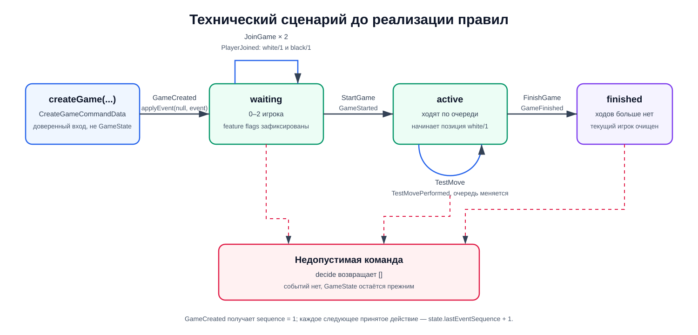

# Технический сценарий

Технический сценарий проверяет архитектуру до появления настоящих правил War
Chest. Он уже даёт серверу авторитетную проверку хода, а клиенту — стабильный
контракт истории, не заставляя временную механику проникать в транспорт или
хранилище.

## Состояния

Пустая история означает, что игры нет: `restoreGame([])` возвращает `null`.
Функция `createGame` принимает доверенную команду `CreateGame` и создаёт первый
`GameCreated` с `sequence = 1`. После `applyEvent(null, event)` появляется
первый настоящий `GameState` со статусом `waiting`.

| Статус     | Что уже произошло                              | Какие команды принимаются                             |
| ---------- | ---------------------------------------------- | ----------------------------------------------------- |
| `waiting`  | Игра создана, игроки занимают места            | `JoinGame`, а после второго игрока — `StartGame`      |
| `active`   | Сформированы команды и определён текущий игрок | `TestMove` или `FinishGame` только от текущего игрока |
| `finished` | В `GameFinished` записана победившая команда   | Никакие команды                                       |

Каждая принятая команда после создания игры создаёт ровно одно событие
технического сценария. `sequence` этого события равен
`state.lastEventSequence + 1`. После применения события поле
`lastEventSequence` становится равным его `sequence`.

Server-owned presence-команды обрабатываются отдельным `decidePresence` и могут
создать одно событие либо атомарную цепочку из двух событий. Они не входят в
клиентский `GameCommandData`.

## Создание игры

`CreateGame` не входит в `GameCommandData` и не проходит через `decide`. Это
отдельный доверенный серверный вход. Перед вызовом `createGame` сервер должен
сам прочитать runtime-файл и добавить `featureFlags`; клиент не должен присылать
их как часть обычной игровой команды.

`createGame` всегда возвращает один `GameCreated` с номером `1`, snapshot
feature flags и текущей версией правил. Повторный `GameCreated` внутри одной
истории считается нарушением её структуры.

## Команды и проверки

| Команда      | Когда принимается                                                               | Результат                                                |
| ------------ | ------------------------------------------------------------------------------- | -------------------------------------------------------- |
| `JoinGame`   | В `waiting`, выбранная позиция существует и свободна, такого `playerId` ещё нет | `PlayerJoined` со связанными полями `team` и `seat`      |
| `StartGame`  | В `waiting`, когда заняты обе позиции и команду отправил один из игроков        | `GameStarted`; первым ходит игрок на позиции `white/1`   |
| `TestMove`   | В `active` и только от текущего игрока                                          | `TestMovePerformed`; ход переходит второму игроку        |
| `FinishGame` | В `active` и только от текущего игрока                                          | `GameFinished` с командой текущего игрока в `winnerTeam` |

`GameCreated` сразу создаёт пустые массивы `white` и `black`. В технической
партии у каждой команды один игрок: UI предлагает свободные позиции `white/1` и
`black/1`, а `JoinGame` передаёт связанные поля `team` и `seat` в движок.
`PlayerJoined` добавляет игрока в выбранную команду ещё в состоянии `waiting`,
поэтому `GameStarted` хранит только `firstPlayerId` и не дублирует состав. Поля
позиции всегда выбираются вместе: она не может содержать только команду или
только место. Та же форма события позволит позже предоставить места `1` и `2`
внутри каждой команды без изменения контракта состояния.

У `TestMove` есть необязательное поле `privateData` типа JSON. Если его нет,
движок записывает `null`. Эти данные нужны только для проверки будущего
механизма скрытой информации: публичные счётчики хода видны всем, а
`privateData` — только сделавшему ход игроку.

## Presence и reconnect timeout

Каждый игрок хранит `presence` и nullable `reconnectDeadline`. После старта
`DisconnectPlayer` принимается только для подключённого участника и создаёт
`PlayerDisconnected`. `ReconnectPlayer` принимается не позже сохранённого
deadline и создаёт `PlayerReconnected`. `DefeatDisconnectedPlayer` требует тот
же deadline и время не раньше него.

Поражение создаёт `PlayerDefeated` с причиной `disconnectTimeout`. Если остаётся
другой непобеждённый игрок, результат также содержит следующий по sequence
`GameFinished` с его командой. Timestamp должны быть каноническими ISO 8601 UTC;
планирование времени остаётся ответственностью server.

## Отказ команды

`decide` не выбрасывает доменную ошибку и не изменяет переданный `GameState`.
Если команда не подходит текущему статусу, нарушает очередь, дублирует игрока
или выбирает неизвестную либо занятую позицию, функция возвращает `[]`.

Причину отказа текущий контракт не кодирует. Сервер сможет сопоставить пустой
результат с контекстом запроса и вернуть транспортную ошибку, но сам движок пока
не различает, например, неверную очередь и уже завершённую игру.

## Что намеренно отложено

- настоящее поле, карты, жетоны и боевые правила War Chest;
- победа по полным игровым правилам вместо технической команды завершения;
- изменение очереди для партии с более чем двумя игроками после
  `PlayerDefeated`;
- присоединение зрителя как игровая команда — роль зрителя задаётся только при
  построении представления;
- несколько событий как результат одной команды;
- отдельные описания причин отклонения команды.
