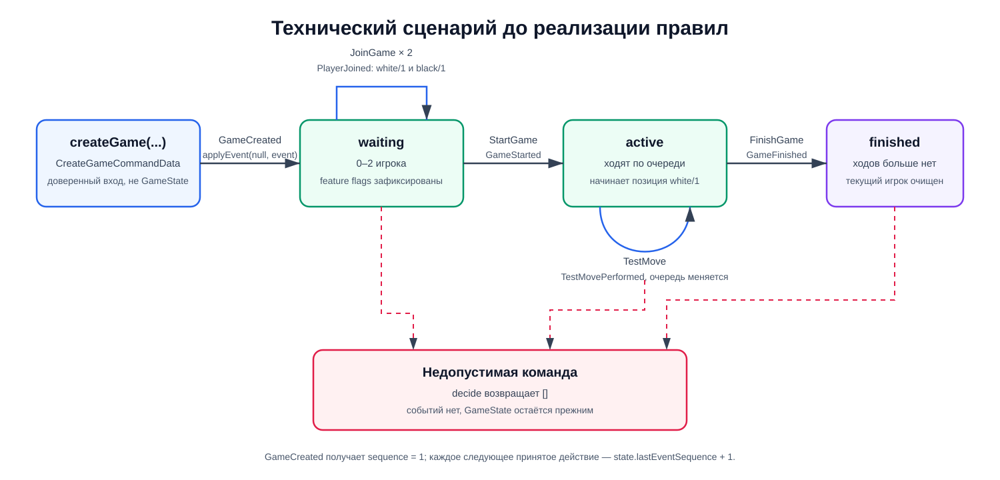

# Технический сценарий

Технический сценарий проверяет архитектуру до появления настоящих правил War
Chest. Он уже даёт серверу авторитетную проверку хода, а клиенту — стабильный
контракт истории, не заставляя временную механику проникать в транспорт или
хранилище. Сейчас этот сценарий расширен подготовкой 1×1/2×2, выбором карт
и первыми дуэльными действиями; `TestMove` используется только в тестах.

Схема показывает исходный инфраструктурный сценарий. Актуальные состояния
и команды перечислены ниже.

## Состояния

Пустая история означает, что игры нет: `restoreGame([])` возвращает `null`.
Функция `createGame` принимает доверенную команду `CreateGame` и создаёт первый
`GameCreated` с `sequence = 1`. После `applyEvent(null, event)` появляется
первый настоящий `GameState` со статусом `waiting`.

| Статус            | Что уже произошло                                | Какие команды принимаются                                                           |
|-------------------|--------------------------------------------------|-------------------------------------------------------------------------------------|
| `waiting`         | Игра создана, игроки занимают места              | `JoinGame`, `LeaveGame`, `UpdateGameSettings`, `SwapPlayerPositions`, `StartGame`   |
| `cardSelection`   | Начат Draft или Elimination Draft                | `ConfirmCardChoice`, `CompleteCardSelection`, `SurrenderGame`                       |
| `active`          | Карты распределены и подготовлено поле           | `PassTurn`, `PerformTurnAction` текущего игрока или `SurrenderGame` любого игрока   |
| `finished`        | В `GameFinished` записана победившая команда     | Никакие команды                                                                     |

Принятая команда после создания игры создаёт одно или несколько событий с
непрерывными sequence. Первое событие получает
`state.lastEventSequence + 1`. После применения всей цепочки поле
`lastEventSequence` становится равным sequence последнего события.

Server-owned presence-команды обрабатываются отдельным `decidePresence` и могут
создать одно событие либо атомарную цепочку из двух событий. Они не входят в
клиентский `GameCommandData`.

## Создание игры

`CreateGame` не входит в `GameCommandData` и не проходит через `decide`. Это
отдельный доверенный серверный вход. Перед вызовом `createGame` сервер должен
сам прочитать runtime-файл и добавить `featureFlags`; клиент не должен присылать
их как часть обычной игровой команды.

`createGame` всегда возвращает один `GameCreated` с номером `1`, snapshot
feature flags, `creatorId` и текущей версией правил. Идентификатор создателя
остаётся в состоянии независимо от выбранных мест и определяет право запуска.
Повторный `GameCreated` внутри одной истории считается нарушением её структуры.

## Команды и проверки

| Команда                   | Когда принимается                                                      | Результат                                                                                            |
|---------------------------|------------------------------------------------------------------------|------------------------------------------------------------------------------------------------------|
| `JoinGame`                | В `waiting`, выбранная позиция существует и свободна                   | `PlayerJoined` или `PlayerPositionChanged` с позицией                                                |
| `LeaveGame`               | В `waiting` от присоединившегося игрока                                | `PlayerLeft`; игрок удаляется из позиции и состава                                                   |
| `UpdateGameSettings`      | В `waiting`, от создателя, с допустимыми настройками                   | `GameSettingsUpdated`                                                                                |
| `StartGame`               | В `waiting`, заполнен состав 1×1/2×2 и команду отправил создатель      | `GameStarted`, `CardsPrepared`; для Random также `BattlefieldPrepared`                               |
| `SwapPlayerPositions`     | В `waiting` в дуэли, заняты обе позиции и команду отправил создатель   | `PlayerPositionsSwapped` с двумя конечными позициями                                                 |
| `ConfirmCardChoice`       | В `cardSelection`, выбор соответствует очереди и фазе                  | `CardChoiceConfirmed`; последняя карта и переход к столу автоматические                              |
| `CompleteCardSelection`   | Распределение завершено или осталась одна выдаваемая карта             | `BattlefieldPrepared`, `CardSelectionCompleted`; при необходимости последняя `CardChoiceConfirmed`   |
| `PassTurn`                | В `active` в дуэли, от текущего игрока, с жетоном в руке               | `TurnPassed`; жетон закрыто сбрасывается, очередь продолжается                                       |
| `PerformTurnAction`       | В активной дуэли, от текущего игрока, с допустимой целью               | `TurnActionPerformed`; наём, розыгрыш или перемещение                                                |
| `FinishGame`              | В `active` и только от текущего игрока                                 | `GameFinished` с командой текущего игрока в `winnerTeam`                                             |
| `SurrenderGame`           | В `active` или `cardSelection` от непобеждённого игрока                | `PlayerDefeated(surrender)`, затем `GameFinished`; полные командные правила ещё не согласованы       |

`GameCreated` сразу создаёт пустые массивы `white` и `black`. Дуэль предлагает
позиции `white/1` и `black/1`, командная партия — места `1` и `2` в обеих
командах. `JoinGame` передаёт связанные поля `team` и `seat` в движок.
`PlayerJoined` добавляет игрока в выбранную команду ещё в состоянии `waiting`,
а повторная команда от этого игрока переносит его на другую свободную позицию
через `PlayerPositionChanged`. Когда все позиции заняты, свободной цели для
переноса уже нет. В дуэли создатель может обменять игроков местами одной командой.
`PlayerLeft` освобождает позицию до старта и полностью удаляет игрока из
составов текущего состояния. Закрытие лобби создателем обрабатывается уровнем
server: вся незапущенная игра удаляется, поэтому отдельного доменного события
отмены в истории нет.
Запуск при этом остаётся правом создателя: ему не обязательно
занимать одну из позиций. Поэтому `GameStarted` хранит только `firstPlayerId` и
не дублирует состав. Поля позиции всегда выбираются вместе: она не может содержать
только команду или только место. Оба формата уже используют этот контракт.

Подробный контракт `PassTurn`, перехода раунда и скрытой информации описан в
[цикле ресурсов и пасе](./turns.md). Старая команда `TestMove` остаётся только
внутренним диагностическим сценарием тестов движка и не входит в публичные API
contracts или UI. Наём, розыгрыш и перемещение описаны в
[действиях отрядов](./recruitAndDeploy.md) и [перемещении](./movement.md).
В публичном API `PerformTurnAction` подтверждается через turn draft;
его прямая отправка по сокету отклоняется.

## Presence и reconnect timeout

Каждый игрок хранит `presence` и nullable `reconnectDeadline`. После старта
`DisconnectPlayer` принимается только для подключённого участника и создаёт
`PlayerDisconnected`. `ReconnectPlayer` принимается не позже сохранённого
deadline и создаёт `PlayerReconnected`. `DefeatDisconnectedPlayer` требует тот
же deadline и время не раньше него.

Поражение по таймауту создаёт `PlayerDefeated` с причиной `disconnectTimeout`.
Добровольная сдача создаёт то же событие с причиной `surrender` и не зависит
от текущей очереди. Если остаётся другой непобеждённый игрок, результат также
содержит следующий по sequence `GameFinished` с его командой. Timestamp должны
быть каноническими ISO 8601 UTC; планирование времени остаётся ответственностью
server.

## Отказ команды

`decide` не выбрасывает доменную ошибку и не изменяет переданный `GameState`.
Если команда не подходит текущему статусу, нарушает очередь или выбирает
неизвестную либо занятую позицию, функция возвращает `[]`. Повтор текущей
позиции также не создаёт нового события.

Причину отказа текущий контракт не кодирует. Сервер сможет сопоставить пустой
результат с контекстом запроса и вернуть транспортную ошибку, но сам движок пока
не различает, например, неверную очередь и уже завершённую игру.

## Что намеренно отложено

- атака, усиление, захват, перехват инициативы и способности;
- победа по полным игровым правилам вместо технической команды завершения;
- изменение очереди для партии с более чем двумя игроками после
  `PlayerDefeated`;
- присоединение зрителя как игровая команда — роль зрителя задаётся только при
  построении представления;
- отдельные описания причин отклонения команды.
